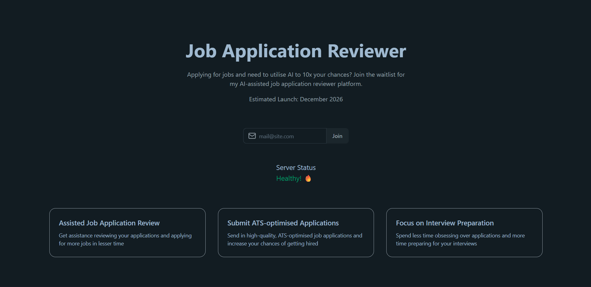
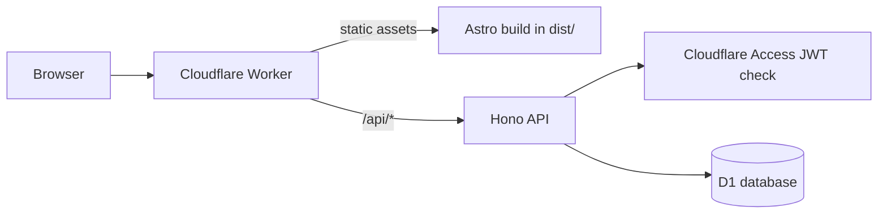

# AI Job Application Reviewer: Waitlist

The waitlist site for an AI job application review tool, built as the first step of my capstone project from a Claude API course. It is a full-stack app on Cloudflare: an Astro and React landing page, a Hono API running on Cloudflare Workers, and a Cloudflare D1 database managed with Drizzle ORM.

**Status: in progress.** See [Project status](#project-status) for what works today and what is next.



## What is in the app

- **Landing page:** a hero section, an email signup form, a server-status indicator, and three feature cards (assisted application review, ATS-optimised applications, interview preparation).
- **API:** a Hono app on Cloudflare Workers with a health endpoint at `GET /api/health`.
- **Authentication layer:** API requests are verified against Cloudflare Access. The middleware validates the `cf-access-jwt-assertion` token using the Access public keys (via `jose`), and skips verification when `ENVIRONMENT` is `development`.
- **Database:** a Cloudflare D1 (SQLite) `subscribers` table defined with Drizzle ORM, with migrations. Columns include a unique email, timestamps, traffic source, device, email-verified and unsubscribed timestamps, and a confirmation token.
- **Environments:** local, staging, and production configurations in `wrangler.jsonc`, with separate D1 databases for local and staging.

## Tech stack

| Area     | Technologies                                      |
| -------- | ------------------------------------------------- |
| Frontend | Astro, React, Tailwind CSS, daisyUI, Lucide icons |
| API      | Hono on Cloudflare Workers                        |
| Database | Cloudflare D1, Drizzle ORM and Drizzle Kit        |
| Auth     | Cloudflare Access (JWT verification with `jose`)  |
| Tooling  | Bun, Wrangler, ESLint, Prettier                   |

## Architecture



The Astro app lives in `src/client` and is built to `dist/`, which the Worker serves as static assets. The API lives in `src/server`. In local development, Astro proxies `/api` requests to the Worker on port 8787.

## Getting started

### Prerequisites

- [Bun](https://bun.sh)
- A Cloudflare account (only needed to deploy)

### Install

```bash
git clone https://github.com/Chiazamoku-Amadi/waitlist.git
cd waitlist
bun install
```

### Configure local environment

Copy the example file and set the environment to `development`, which skips the Cloudflare Access check locally:

```bash
cp .env.example .env
```

```env
ENVIRONMENT=development
```

Wrangler loads `.env` from the project root during local development.

### Create the local database and run

```bash
bun run db:migrate:local
bun run dev
```

`bun run dev` starts the Astro dev server and `wrangler dev` together. Open the Astro URL printed in your terminal (Astro's default is http://localhost:4321). The API runs on http://localhost:8787.

## Scripts

| Command                                  | What it does                                 |
| ---------------------------------------- | -------------------------------------------- |
| `bun run dev`                            | Run the Astro client and the Worker together |
| `bun run client`                         | Run only the Astro dev server                |
| `bun run worker`                         | Run only the Worker (`wrangler dev`)         |
| `bun run build:client`                   | Build the Astro app to `dist/`               |
| `bun run lint`                           | Lint `src/` with ESLint                      |
| `bun run format` / `format:check`        | Format with Prettier, or check formatting    |
| `bun run db:generate`                    | Generate a Drizzle migration from the schema |
| `bun run db:migrate:local`               | Apply migrations to the local D1 database    |
| `bun run db:migrate:staging`             | Apply migrations to the staging D1 database  |
| `bun run dryrun:staging` / `dryrun:prod` | Build and run a deploy dry run               |
| `bun run deploy:staging` / `deploy:prod` | Build and deploy to Cloudflare               |

## Deployment

The staging environment is deployed to Cloudflare Workers and protected by Cloudflare Access. To deploy staging:

```bash
bun run db:migrate:staging
bun run deploy:staging
```

Staging needs the `CF_ACCESS_DOMAIN` and `POLICY_AUD` variables from your Cloudflare Access application. The production environment is not set up yet.

## Project structure

```
.
├── src/
│   ├── client/            # Astro app (pages, layouts, components)
│   └── server/
│       ├── index.ts       # Hono API entry
│       ├── middleware/    # Cloudflare Access auth
│       └── db/            # Drizzle schema and migrations
├── astro.config.mjs
├── drizzle.config.ts
└── wrangler.jsonc         # Worker, D1 bindings, and environments
```

## Project status

**Working today**

- Landing page and layout
- API with a health endpoint behind Cloudflare Access verification
- D1 schema and migrations for subscribers
- Staging deployment on Cloudflare Workers

**Not built yet**

- Email signup: the form on the landing page is UI only and is not connected to an API endpoint
- Email confirmation and unsubscribe flows (the database schema already has the fields for them)
- Production deployment
- Automated tests and a CI pipeline

## Author

**Chiazamoku Amadi** · [GitHub](https://github.com/Chiazamoku-Amadi) · [LinkedIn](https://www.linkedin.com/in/chiazamoku-amadi) · [Portfolio](https://chiazamoku-portfolio.netlify.app)
